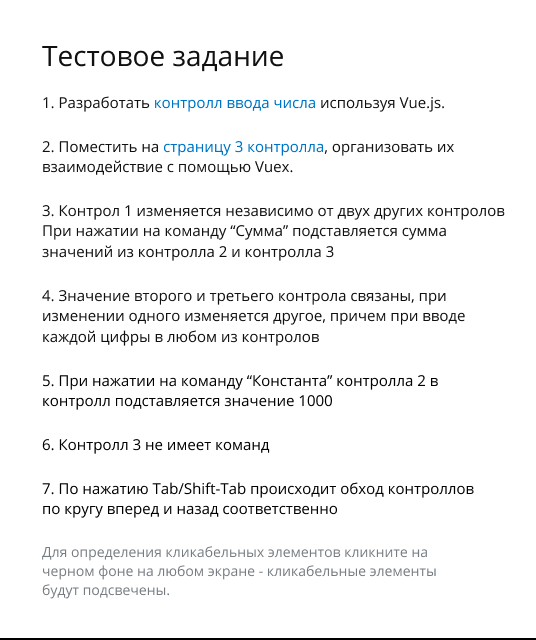
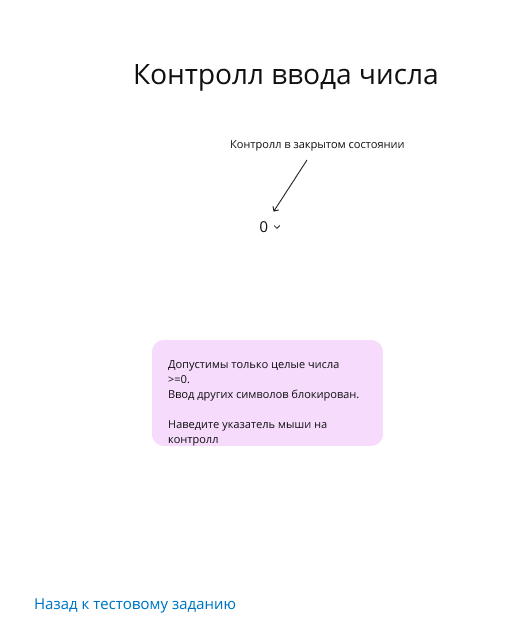
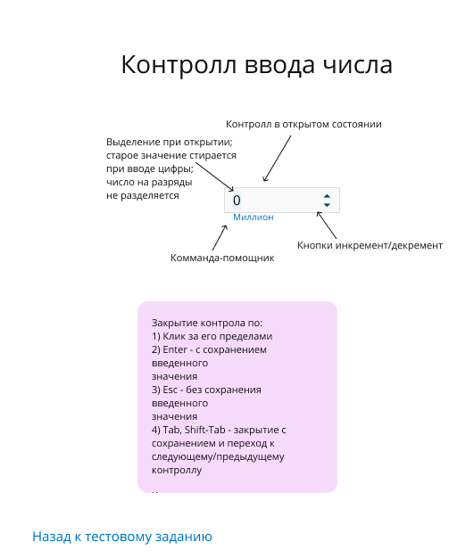
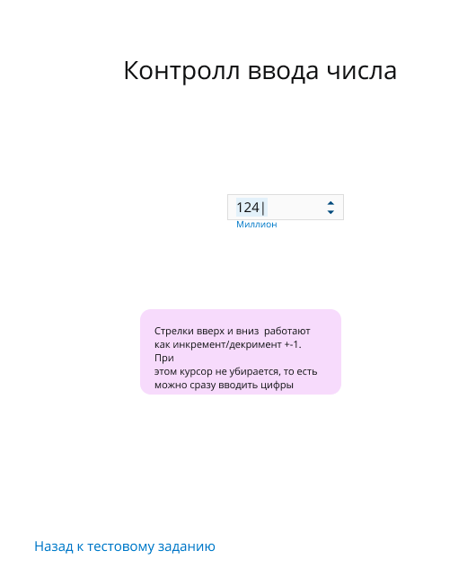
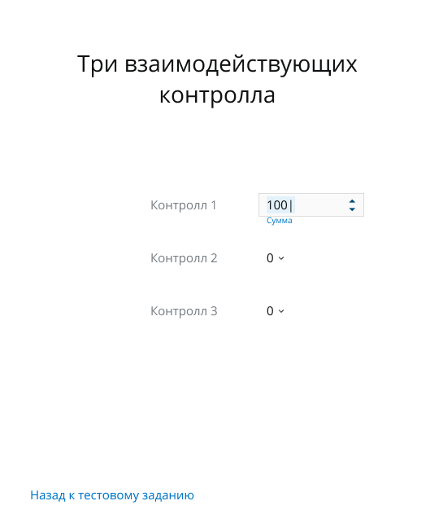

# ПАРИТЕТ РДЦ Тестовое задание

# Запуск

Запустите эту команду находясь в папке с проектом в командной строке 

```npm install && npm run dev```

Приложение покрыто тестами, их можно запустить с помощью 

```npm run test```

Сервак запуститься на 

```http://localhost:8080```

# Суть задания 








# Примечание

Модуль vuex под названием loader это часть моего стартового темплейта и не относится к тестовому заданию.
В темплейте настроено разбиение кода на части и этот модуль отвественен за показ лоадера между загрузками скриптов.
